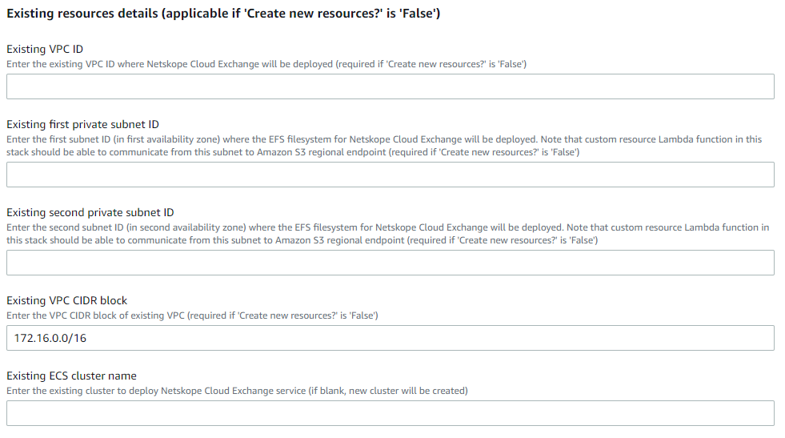
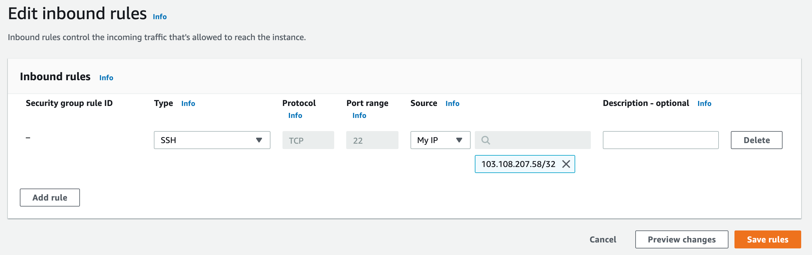

# Deploying Netskope Cloud Exchange using AWS ECS Fargate

The Netskope Cloud Exchange (CE) provides customers with powerful integration tools to leverage investments across their security posture.

Cloud Exchange consumes valuable Netskope telemetry and external threat intelligence and risk scores, enabling improved policy implementation, automated service ticket creation, and exportation of log events from the Netskope Security Cloud. 

To learn more about Netskope Cloud Exchange please refer to the [Netskope Cloud Exchange introduction page](https://www.netskope.com/products/capabilities/cloud-exchange).

Amazon Elastic Container Service (Amazon ECS) is a fully managed container orchestration service that makes it easy for you to deploy, manage and scale containerized applications.

AWS Fargate is a serverless, pay-as-you-go compute engine that lets you focus on building applications without managing servers. AWS Fargate is compatible with Amazon Elastic Container Service (ECS). To learn more about Amazon ECS please follow the [Amazon ECS](https://aws.amazon.com/ecs/) documentation page. To learn more about AWS Fargate please follow the [AWS Fargate](https://aws.amazon.com/fargate/) documentation page.

AWS CloudFormation is a service that helps you model and set up your AWS resources so that you can spend less time managing those resources and more time focusing on your applications that run in AWS. To learn more about AWS CloudFormation please follow the [AWS CloudFormation](https://aws.amazon.com/cloudformation/) documentation page.

This document will guide you on how to deploy Netskope Cloud Exchange on AWS Fargate using AWS CloudFormation. 

This solution consists of the following components:

**NetskopeCECloudFormation.yaml** - AWS CloudFormation template that deploys the following resources:

- Networking Resources - VPC, Private Subnets (ECS Cluster, ALB), Public Subnets (for NAT Gateway), Internet Gateway, Security Groups 
- Amazon EFS filesystem for Netskope Cloud Exchange
- NetskopeCloudExchangeTaskRole and NetskopeCloudExchangeTaskExecutionRole AWS IAM roles 
- Amazon ECS Task Definition
- Amazon ECS Fargate Cluster for deploying Netskope Cloud Exchange
- Amazon Application Load Balancer (optional)

## Service Quotas

The solution deploys a number of resources on your AWS account. You may need to consider service quotas (formerly known as service limits) on your account and increase them accordingly. Please refer to the table representing the number of resources created by the solution and review the service quotas following the service quotas documentation for each service. Please see the [AWS service quotas](https://docs.aws.amazon.com/AmazonECS/latest/developerguide/service-quotas.html) for more details.

For example, the solution deploys 4 container instances on your Amazon ECS cluster. The non-adjustable quota for the number of container instances per cluster is 5000. Consider this limit when choosing the ECS cluster to host Netskope Cloud Exchange. You can find more details about Amazon ECS service quotas [here](https://docs.aws.amazon.com/AmazonECS/latest/developerguide/service-quotas.html)

|Resource|Resource Count|Service Quotas References|
| :- | :- | :- |
|AWS IAM Role|2|[AWS IAM service quotas](https://docs.aws.amazon.com/IAM/latest/UserGuide/reference_iam-quotas.html)|
|AWS IAM Policy|1|[AWS IAM service quotas](https://docs.aws.amazon.com/IAM/latest/UserGuide/reference_iam-quotas.html)|
|Amazon EFS File System|1|[Amazon EFS service quotas](https://docs.aws.amazon.com/efs/latest/ug/limits.html)|
|Amazon EFS Mount Target|2|[Amazon EFS service quotas](https://docs.aws.amazon.com/efs/latest/ug/limits.html)|
|Amazon EFS Access Point|4|[Amazon EFS service quotas](https://docs.aws.amazon.com/efs/latest/ug/limits.html)|
|Amazon CloudWatch Log Group|1|[Amazon CloudWatch service quotas](https://docs.aws.amazon.com/AmazonCloudWatch/latest/monitoring/cloudwatch_limits.html)|
|Amazon VPC|1|[Amazon VPC quotas](https://docs.aws.amazon.com/vpc/latest/userguide/amazon-vpc-limits.html)|
|Amazon Subnets|4|[Amazon VPC quotas](https://docs.aws.amazon.com/vpc/latest/userguide/amazon-vpc-limits.html)|
|Amazon Elastic IPs|2|[Amazon VPC quotas](https://docs.aws.amazon.com/vpc/latest/userguide/amazon-vpc-limits.html)|
|Amazon NAT Gateways|2|[Amazon VPC quotas](https://docs.aws.amazon.com/vpc/latest/userguide/amazon-vpc-limits.html)|
|Amazon Internet Gateway|1|[Amazon VPC quotas](https://docs.aws.amazon.com/vpc/latest/userguide/amazon-vpc-limits.html)|
|Amazon Route Table|4|[Amazon VPC quotas](https://docs.aws.amazon.com/vpc/latest/userguide/amazon-vpc-limits.html)|
|Amazon Application Load Balancer|1|[Application Load Balancers quotas](https://docs.aws.amazon.com/vpc/latest/userguide/amazon-vpc-limits.html)|
|Amazon Target group|1|[Application Load Balancers quotas](https://docs.aws.amazon.com/vpc/latest/userguide/amazon-vpc-limits.html)|
|Amazon EC2 Security Group|3|[Amazon EC2 service quotas](https://docs.aws.amazon.com/AWSEC2/latest/UserGuide/ec2-resource-limits.html)|
|Amazon ECS Service|1|[Amazon ECS service quotas](https://docs.aws.amazon.com/AmazonECS/latest/developerguide/service-quotas.html)|
|Amazon ECS Task|1|[Amazon ECS service quotas](https://docs.aws.amazon.com/AmazonECS/latest/developerguide/service-quotas.html)|
|Amazon ECS Cluster|1|[Amazon ECS service quotas](https://docs.aws.amazon.com/AmazonECS/latest/developerguide/service-quotas.html)|
|Amazon ECS Container Instance|4|[Amazon ECS service quotas](https://docs.aws.amazon.com/AmazonECS/latest/developerguide/service-quotas.html)|

## Architecture Diagram

*Fig 1. Netskope Cloud Exchange on AWS Fargate for Amazon ECS*

## Prerequisites 
The following prerequisites are required to implement the Netskope Cloud Exchange on AWS Fargate for Amazon ECS.

- This solution guide assumes working knowledge of the AWS management console. We also recommend that you become familiar with the following AWS services.  
&emsp;&emsp; - [AWS CloudFormation](https://docs.aws.amazon.com/AWSCloudFormation/latest/UserGuide/GettingStarted.html)  
&emsp;&emsp; - [Amazon ECS](https://aws.amazon.com/ecs/)  
&emsp;&emsp; - [AWS Fargate](https://aws.amazon.com/fargate/)  
&emsp;&emsp; - [Amazon VPC](https://aws.amazon.com/vpc/)  
&emsp;&emsp; - [Amazon CloudWatch](https://aws.amazon.com/cloudwatch/)  

## Deployment & Configuration Steps

Using the CloudFormation template you can deploy the Netskope Cloud Exchange in two ways.

1. Deploy both Infrastructure + Netskope Cloud Exchange using the AWS CloudFormation
2. Customize Infrastructure with existing resources (VPC, Subnets, NAT Gateway, ALB, ECS Cluster, etc.) and deploy Netskope Cloud Exchange using AWS CloudFormation

### 1. Deploy both Infrastructure + Netskope Cloud Exchange using the AWS CloudFormation

If you have your existing resources available, refer [ Customize Infrastructure with existing resources (VPC, Subnets, NAT Gateway, ALB, ECS Cluster, etc.) and deploy Netskope Cloud Exchange using AWS CloudFormation](#2-customize-infrastructure-with-existing-resources-vpc-subnets-nat-gateway-alb-ecs-cluster-etc-and-deploy-netskope-cloud-exchange-using-aws-cloudformation)

1.1 Download the **[NetskopeCECloudFormation.yaml](https://github.com/netskopeoss/Netskope-CloudExchange-Amazon-ECS-Fargate/blob/main/CloudExchangeTemplate.yaml).**

1.2 Deploy the CloudFormation Stack on the AWS Management account.

1.2.1 Sign in to the AWS Management Console.

1.2.2 Navigate to the AWS CloudFormation management console and choose the region you'd like to deploy the automation solution.

1.2.3 Click on **Create stack** and choose **With new resources (standard).**

1.2.4 Choose **Upload a template file** then click on **Choose file**. Choose the [NetskopeCECloudFormation.yaml](https://github.com/netskopeoss/Netskope-CloudExchange-Amazon-ECS-Fargate/blob/main/CloudExchangeTemplate.yaml)  from the directory on your disk where you downloaded it, click **Open**, and then click **Next**. 

1.2.5 Enter the Stack name.

1.2.6 In the Parameters section select **True** in **Create new resources?** 
Provide an appropriate value for **Environment name**. 
Select **True** in **Create Application Load Balancer?** if you want to create ALB or Select **False** if you don't want to create.

1.2.7 Skip the **Existing resource details(applicable if 'Create new resources?' is 'False')** section and navigate to the **Network details (applicable if 'Create new resources?' is 'True').**

Enter the VPC name and CIDR Ranges for VPC, Private, and Public Subnets according to your network requirements, or leave the default details as it is.

1.2.8 Enter the Environment variables required for Netskope CE Deployment and click on **Next**.   
**Environment variables**  
* JWT secrets: A random secure string that will be used for signing the authentication tokens
* Maintainance password: A maintenance password that will be used for RabbitMQ and MongoDB services (This password can be set only once)
* Maintenance password escaped: URL encoded version of the Maintenance Password
* TLS version: The TLS version that will be used to access the UI (TLSv1.3, TLSv1.2 TLSv1.3)
* HTTP proxy: Proxy URL to be used for the outbound HTTP traffic
* HTTPS proxy: Proxy URL to be used for the outbound HTTPS traffic
* CIDR to allow access to Netskope Cloud Exchange: IP range to grant access for Netskope Cloud Exchange (*required if load balancer is to be used*)

1.2.9 In the **Configure stack options** section , specify tags (key-value pairs) to apply to resources in your stack. You can add up to 50 unique tags for each stack.

1.2.10 In the **Permissions** section , choose an IAM role to explicitly define how CloudFormation can create, modify, or delete resources in the stack. If you don't choose a role, CloudFormation uses permissions based on your user credentials.

1.2.11 You can set additional options for your stack, like notification options and a stack policy in **Advanced Options** and click on **Next**.

1.2.12 Review the Stack details.

1.2.13 Select the checkbox of acknowledgment of IAM resources and click on **Create stack**.

1.2.14 Wait for the Creation of Stack to be completed.

After the successful creation, you can see the list of resources by selecting the **Resources** tab.

1.2.15 To access the application, refer to [Accessing Netskope CE](#accessing-netskope-ce).

### 2. Customize Infrastructure with existing resources (VPC, Subnets, NAT Gateway, ALB, ECS Cluster, etc.) and deploy Netskope Cloud Exchange using AWS CloudFormation

2.1 Download the **[NetskopeCECloudFormation.yaml](https://github.com/netskopeoss/Netskope-CloudExchange-Amazon-ECS-Fargate/blob/main/CloudExchangeTemplate.yaml)**.

2.2 Deploy the CloudFormation Stack on the AWS Management account.

2.2.1 Sign in to the AWS Management Console.

2.2.2 Navigate to the AWS CloudFormation management console and choose the region you'd like to deploy the automation solution.

2.2.3 Click on **Create Stack** and choose **With new resources (standard)**.

2.2.4 Choose **Upload a template file** then click on Choose file. Choose the [NetskopeCECloudFormation.yaml](https://github.com/netskopeoss/Netskope-CloudExchange-Amazon-ECS-Fargate/blob/main/CloudExchangeTemplate.yaml)  from the directory on your disk where you downloaded it to, click **Open** and then click **Next**. 

2.2.5 Enter the Stack name.

2.2.6 In the Parameters section select **False** in **Create new resources?**. 
Provide an appropriate value for **Environment name**. 
Select **True** in **Create Application Load Balancer?** if you want to create ALB or Select **False** if you don't want to create.

2.2.7 Provide the **Existing resources details (applicable if 'Create new resources?' is 'False')**.

*Notes* 
* *You have to enter the details of the resources that are available in your existing AWS infrastructure.* 
* *Consider the following for Application Load Balancer.*
  * *If you have selected **False** in **Create Application Load Balancer?** and **Existing ARN of target group for ALB** field is **Blank** - No ALB will be created.*
  * *If you have selected **False** in **Create Application Load Balancer?** and **Existing ARN of target group for ALB** field is **Provided** - Existing ALB will be Used.*  
* *Consider the following for AWS ECS Cluster.*  
  * *If **Existing  ECS cluster name** field is blank - A new ECS Cluster will be created.*
  * *If **Existing  ECS cluster name** field is provided - It will check for the Cluster, if the Cluster is present, then it will be used as an existing resource or else it will throw the error at the time of stack creation.*

To Find Existing resources details please follow the details below.
* For VPC ID - [Finding a VPC ID](#finding-a-vpc-id) 
* For Subnet ID - [Finding a Subnet ID](#finding-a-subnet-id)
* For VPC CIDR block - [Finding a VPC CIDR block](#finding-a-vpc-cidr-block)
* For ARN of target group for ALB - [Finding ARN of target group for ALB](#finding-arn-of-target-group-for-alb)
* For ECS Cluster Name - [Finding ECS Cluster Name](#finding-ecs-cluster-name)

2.2.8 Enter the Environment variables required for Netskope CE Deployment and click on **Next**.   
**Environment variables**  
* JWT secrets: A random secure string that will be used for signing the authentication tokens
* Maintainance password: A maintenance password that will be used for RabbitMQ and MongoDB services (This password can be set only once)
* Maintenance password escaped: URL encoded version of the Maintenance Password
* TLS version: The TLS version that will be used to access the UI (TLSv1.3, TLSv1.2 TLSv1.3)
* HTTP proxy: Proxy URL to be used for the outbound HTTP traffic
* HTTPS proxy: Proxy URL to be used for the outbound HTTPS traffic
* CIDR to allow access to Netskope Cloud Exchange: IP range to grant access for Netskope Cloud Exchange (*required if load balancer is to be used*)

2.2.9 In the **Configure stack options** section, specify tags (key-value pairs) to apply to resources in your stack. You can add up to 50 unique tags for each stack.

2.2.10 In the **Permissions** section, choose an IAM role to explicitly define how CloudFormation can create, modify, or delete resources in the stack. If you don't choose a role, CloudFormation uses permissions based on your user credentials.

2.2.11 You can set additional options for your stack, like notification options and a stack policy in **Advanced Options** and click on **Next**.

2.2.12 Review the Stack details.

2.2.13 Select the checkbox of acknowledgment of IAM resources and click on **Create stack**.

2.2.14 Wait for the Creation of Stack to be completed.

After the successful creation, you can see the list of resources by selecting the **Resources** tab.  

2.2.15 To access the application, refer to [Accessing Netskope CE](#accessing-netskope-ce).

### Finding a VPC ID
Go to VPC Console, select **VPCs** and the relevant VPC. The VPC details page for the selected VPC opens with information including the VPC ID.

### Finding a Subnet ID
Go to VPC Console, select **VPCs** and the relevant VPC. The VPC details page for the selected VPC opens with a table of subnets, click a subnet ID to open the details page and find the Subnet ID.

### Finding a VPC CIDR block
Go to VPC Console, select **VPCs** and the relevant VPC. The VPC details page for the selected VPC opens with information including the CIDRs section.

### Finding ARN of target group for ALB
Go to EC2 console, select **Target Groups** and relevant Target Group. The Target Group details page for the selected Target Group opens the information including the ARN of Target Group.

### Finding ECS Cluster Name
Go to ECS Console, select **Clusters** and relevant Cluster. The Cluster details page for the selected Cluster opens the information including the Cluster Name.

## Accessing Netskope CE 

**Access Netskope Cloud Exchange through Jumphost**

1. Go to EC2 Console, select **Launch instance**.

2. Provide the name for an instance and select Application and OS Image for instance.

3. Select instance type and key pair to SSH into it. 
*Note - Create new key pair if you are not having any key pair for login*.

4. Edit the network settings and provide the details.

*Notes* 
* *VPC for instance and your CloudFormation resources must be same.*
* *Select the one of the public subnets to launch the instance.*
* *Select **Enable** the **Auto-assign public IP** to assign public IP.*

 

5. Click on **Launch instance** and leave the other details as default. Go to EC2 Console and wait for **Instance state** of your instance to become **Running**.  

6. Select the instance and Click on **Connect** which will open **Connect to instance** page. Click on **SSH Client** tab and copy the SSH command to the clipboard.

6. Go to EC2 Console, Select **Security Groups** and relevant security group. Click on **Edit inbound rules** and allow 8000 port.

7. Go to EC2 Console, Select **Load Balancers** and relevant ALB. The ALB details page for the selected ALB opens the information including the DNS Name of ALB. Copy the DNS Name of ALB to the clipboard.

8. Open Git Bash or terminal of end user's local system and paste the following command that initiates the port forwarding from the local system to AWS EC2 Instance. 
*Note - If ALB was not used in deployment, go to 8.2 Applocation Load Balancer is not present.*

   **8.1 Application Load Balancer is present**  
  **Command:**   ssh -L LOCAL_HOST_PORT:ALB_DNS_NAME:LOAD_BALANCER_PORT   
  **Example:** ssh -i "test-demo.pem" ubuntu@ec2-54-193-33-60.us-west-1.compute.amazonaws.com -L 8000:internal-NetskopeCELB-netskope-ce.us-west-1.elb.amazonaws.com:80
  

   **8.2 Application Load Balancer is not present**  
   **Command:**   ssh -L LOCAL_HOST_PORT:FARGATE_TASK_PRIVATE_IP:3000
   **Example:**   ssh -i "test-demo.pem" ubuntu@ec2-54-193-33-60.us-west-1.compute.amazonaws.com -L 8000:172.16.2.86:3000 
   *Note - To find Private IP of Task created in Fargate Cluster, refer to [Finding Private IP of Task in Fargate Cluster](#finding-private-ip-of-task-in-fargate-cluster)*
  

9. Type *localhost:8000* in browser and access the application.

### Finding Private IP of Task in Fargate Cluster
Go to ECS Console, select **Clusters** and relevant Cluster.The Cluster details page for the selected Cluster opens the information. Click on **Tasks** tab and select the relevant task.

After selecting the relevent task, it opens the information including the private IP.

## Best Practices (Dos and Don'ts)

* For the best security practices, we do not recommend assigning a public IP address to the Netskope Cloud Exchange service, but rather accessing it using a private IP address either via a jump host, Amazon Direct Connect, or [Netskope Private Access](https://www.netskope.com/products/private-access) (NPA).

* When first installed, Cloud Exchange does not require an SSL certificate and the web server can be reached over an unencrypted connection. You can either access front-end Netskope Cloud Exchange with [Application Load Balancer](https://docs.aws.amazon.com/elasticloadbalancing/latest/application/introduction.html) and deploy an SSL certificate there, or install a private SSL certificate on the Netskope Cloud Exchange. To learn how to install a private SSL certificate on the Netskope Cloud Exchange please see the documentation [here](https://docs.netskope.com/en/install-cloud-exchange.html). To learn how to create an HTTPS listener and install an SSL certificate on the Application Load Balancer, please follow [this](https://docs.aws.amazon.com/elasticloadbalancing/latest/application/create-https-listener.html) documentation. 

* Manually created resources must be deleted before deleting the stack, as CloudFormation will only delete the resources created using a template file.

## Basic Troubleshooting

* There is a default limit of 5 Elastic IP addresses per Region per AWS account.For more information about limits and how to request an increase, see [Elastic IP address limit](https://docs.aws.amazon.com/AWSEC2/latest/UserGuide/elastic-ip-addresses-eip.html#using-instance-addressing-limit)
* Don't provide long resource name - When the stack is created using CloudFormation, prefix or suffix will be added as per the stack name in resource's name. It will give error if the eventual resource name turns out to be too long.
* If using existing load balancer, please make sure 80 port is not being used by another service, it will be used for accessing Netskope Cloud Exchange service.

