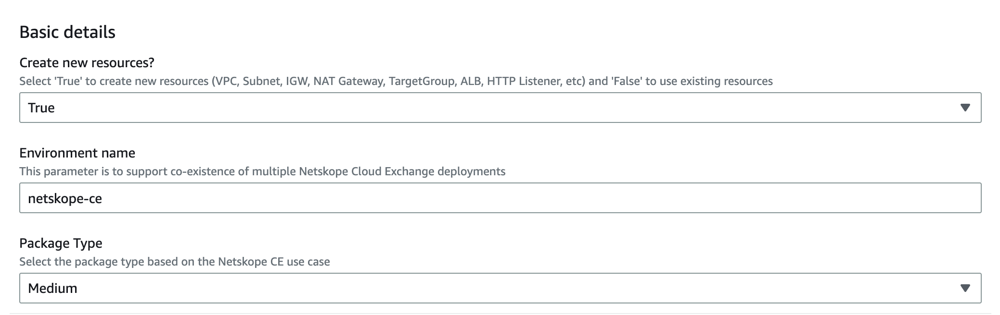
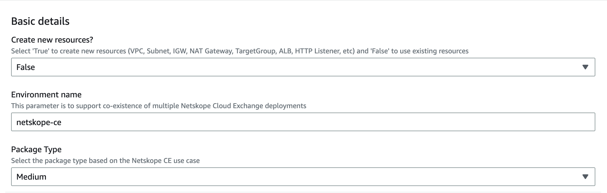
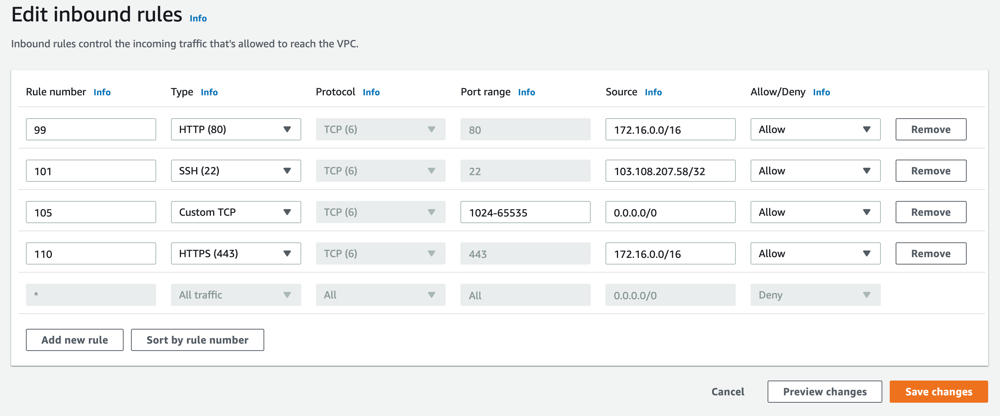
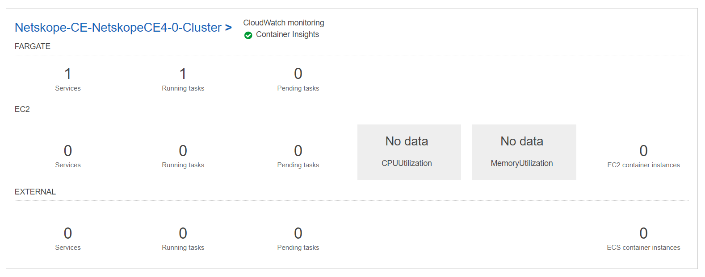

# Deploying Netskope Cloud Exchange using AWS ECS Fargate
<div style="text-align: justify">
The Netskope Cloud Exchange (CE) provides customers with powerful integration tools to leverage investments across their security posture.

Cloud Exchange consumes valuable Netskope telemetry and external threat intelligence and risk scores, enabling improved policy implementation, automated service ticket creation, and exportation of log events from the Netskope Security Cloud. 

To learn more about Netskope Cloud Exchange please refer to the [Netskope Cloud Exchange introduction page](https://www.netskope.com/products/capabilities/cloud-exchange).

Amazon Elastic Container Service (Amazon ECS) is a fully managed container orchestration service that makes it easy for you to deploy, manage and scale containerized applications.

AWS Fargate is a serverless, pay-as-you-go compute engine that lets you focus on building applications without managing servers. AWS Fargate is compatible with Amazon Elastic Container Service (ECS). To learn more about Amazon ECS please follow the [Amazon ECS](https://aws.amazon.com/ecs/) documentation page. To learn more about AWS Fargate please follow the [AWS Fargate](https://aws.amazon.com/fargate/) documentation page.

AWS CloudFormation is a service that helps you model and set up your AWS resources so that you can spend less time managing those resources and more time focusing on your applications that run in AWS. To learn more about AWS CloudFormation please follow the [AWS CloudFormation](https://aws.amazon.com/cloudformation/) documentation page.

This document will guide you on how to deploy Netskope Cloud Exchange on AWS Fargate using AWS CloudFormation. </div>

This solution consists of the following components:

**CloudExchangeTemplate.yaml** - AWS CloudFormation template that deploys the following resources:

- Networking Resources - VPC, Private Subnets (ECS Cluster, ALB), Public Subnets (for NAT Gateway), Internet Gateway, Security Groups 
- Amazon EFS filesystem for Netskope Cloud Exchange
- NetskopeCloudExchangeTaskRole and NetskopeCloudExchangeTaskExecutionRole AWS IAM roles 
- Amazon ECS Task Definition
- Amazon ECS Fargate Cluster for deploying Netskope Cloud Exchange
- Amazon Application Load Balancer (optional)

## Service Quotas

The solution deploys a number of resources on your AWS account. You may need to consider service quotas (formerly known as service limits) on your account and increase them accordingly. Please refer to the table representing the number of resources created by the solution and review the service quotas following the service quotas documentation for each service. Please see the [AWS service quotas](https://docs.aws.amazon.com/AmazonECS/latest/developerguide/service-quotas.html) for more details.

For example, the solution deploys 4 container instances on your Amazon ECS cluster. The non-adjustable quota for the number of container instances per cluster is 5000. Consider this limit when choosing the ECS cluster to host Netskope Cloud Exchange. You can find more details about Amazon ECS service quotas [here](https://docs.aws.amazon.com/AmazonECS/latest/developerguide/service-quotas.html)

|Resource|Resource count|Service Quotas references|
| :- | :- | :- |
|AWS IAM Role|2|[AWS IAM service quotas](https://docs.aws.amazon.com/IAM/latest/UserGuide/reference_iam-quotas.html)|
|AWS IAM Policy|1|[AWS IAM service quotas](https://docs.aws.amazon.com/IAM/latest/UserGuide/reference_iam-quotas.html)|
|Amazon EFS File System|1|[Amazon EFS service quotas](https://docs.aws.amazon.com/efs/latest/ug/limits.html)|
|Amazon EFS Mount Target|2|[Amazon EFS service quotas](https://docs.aws.amazon.com/efs/latest/ug/limits.html)|
|Amazon EFS Access Point|4|[Amazon EFS service quotas](https://docs.aws.amazon.com/efs/latest/ug/limits.html)|
|Amazon CloudWatch Log Group|1|[Amazon CloudWatch service quotas](https://docs.aws.amazon.com/AmazonCloudWatch/latest/monitoring/cloudwatch_limits.html)|
|Amazon VPC|1|[Amazon VPC quotas](https://docs.aws.amazon.com/vpc/latest/userguide/amazon-vpc-limits.html)|
|Amazon Subnets|4|[Amazon VPC quotas](https://docs.aws.amazon.com/vpc/latest/userguide/amazon-vpc-limits.html)|
|Elastic IP addresses|2|[Amazon VPC quotas](https://docs.aws.amazon.com/vpc/latest/userguide/amazon-vpc-limits.html)|
|NAT gateways|2|[Amazon VPC quotas](https://docs.aws.amazon.com/vpc/latest/userguide/amazon-vpc-limits.html)|
|Internet gateways|1|[Amazon VPC quotas](https://docs.aws.amazon.com/vpc/latest/userguide/amazon-vpc-limits.html)|
|Route Table|4|[Amazon VPC quotas](https://docs.aws.amazon.com/vpc/latest/userguide/amazon-vpc-limits.html)|
|Application Load Balancer|1|[Application Load Balancers quotas](https://docs.aws.amazon.com/vpc/latest/userguide/amazon-vpc-limits.html)|
|Target group|1|[Application Load Balancers quotas](https://docs.aws.amazon.com/vpc/latest/userguide/amazon-vpc-limits.html)|
|Amazon EC2 Security Group|3|[Amazon EC2 service quotas](https://docs.aws.amazon.com/AWSEC2/latest/UserGuide/ec2-resource-limits.html)|
|Amazon ECS Service|1|[Amazon ECS service quotas](https://docs.aws.amazon.com/AmazonECS/latest/developerguide/service-quotas.html)|
|Amazon ECS Task|1|[Amazon ECS service quotas](https://docs.aws.amazon.com/AmazonECS/latest/developerguide/service-quotas.html)|
|Amazon ECS Cluster|1|[Amazon ECS service quotas](https://docs.aws.amazon.com/AmazonECS/latest/developerguide/service-quotas.html)|
|Amazon ECS Container Instance|4|[Amazon ECS service quotas](https://docs.aws.amazon.com/AmazonECS/latest/developerguide/service-quotas.html)|
|Amazon S3|2|[Amazon S3 quotas](https://docs.aws.amazon.com/general/latest/gr/s3.html)|


## Architecture Diagram


*Fig 1. Netskope Cloud Exchange on AWS Fargate for Amazon ECS*

## Prerequisites 
The following prerequisites are required to implement the Netskope Cloud Exchange on AWS Fargate for Amazon ECS.

1. It is highly recommended to please refer to the  [Testing Matrix](#testing-matrix) and [Upgrades Testing Matrix](#upgrades-testing-matrix) before proceeding with the further steps.

2. This solution guide assumes working knowledge of the AWS management console. We also recommend that you become familiar with the following AWS services.
    * [AWS CloudFormation](https://docs.aws.amazon.com/AWSCloudFormation/latest/UserGuide/GettingStarted.html) <br/>
    * [Amazon ECS](https://aws.amazon.com/ecs/) <br/>
    * [AWS Fargate](https://aws.amazon.com/fargate/) <br/>
    * [Amazon VPC](https://aws.amazon.com/vpc/) <br/>
    * [Amazon CloudWatch](https://aws.amazon.com/cloudwatch/) <br/>
<br/>

3. Subscription to marketplace solution ([AWS MarketPlace](https://aws.amazon.com/marketplace/pp/prodview-swtuwsyshtqj2)) in the same AWS account is needed (refer to point 5 of Basic Troubleshooting section below for more details).

4. There are below 2 ways of executing the current AWS CloudFormation template. For both the below ways, the required permissions are mentioned in the next point.
    * Using an AWS User account with all necessary permissions<br/>
    * Using an AWS IAM role with all necessary permissions<br/>
<br/>

5. AWS user account or AWS IAM role deploying this Netskope CloudExchange application requires in general, permissions to the below set of AWS services to deploy Netskope CloudExchange CloudFormation Template **(CloudExchangeTemplate.yaml)**. Please make sure that the permissions are in accordance with that.

    * AmazonEC2 <br/>
    * AWSCloudFormation <br/>
    * AmazonElasticFileSystem <br/>
    * AmazonECS <br/>
    * AmazonVPC <br/>
    * AWSLambda <br/>
    * AmazonS3 <br/>
    * AmazonSNS <br/>
    * AmazonEventBridge <br/>
    * CloudWatchLogs <br/>
    * IAM (optional; for why it is optional, please check point 5 below) <br/>
    <br/>

    We have also provided a set of policy JSON files in this [folder](/policy%20files/) which mention all the detailed AWS resource-specific permissions that are required for the AWS user account or AWS IAM role deploying this Netskope CloudExchange application. If the end user is deploying the stack using AWS user account, please ensure that the user account has these permissions while if the end user is deploying the stack using AWS IAM role, then, follow the below steps to create an AWS IAM role with all these required permissions.<br/>
    * Browse to the IAM console. <br/>
    * In the navigation pane of the IAM console, choose Policies, and then choose Create policy. <br/>
    * Go to JSON tab, and copy the content of [Netskope policy file](/policy%20files/NetskopeCE_policy_1.json). <br/>
    * Choose NEXT:Tags. <br/>
    * Choose NEXT:Review. <br/>
    * Enter Name and choose Create policy. <br/>
    * Repeat above steps for all the policy files within the  [Policy folder](/policy%20files/).
    * In the navigation pane of the IAM console, choose Roles, and then choose Create role. <br/>
    * Choose the AWS service role type. <br/>
    * Choose the CloudFormation use case for service. <br/>
    * Choose Next. <br/>
    * Select the policy created above to use for the permissions policy. <br/>
    * Choose Next. <br/>
    * Enter Role name and description for the role. <br/>
    * Review the role, and then choose Create role. <br/>
    <br/>

6. If out of security constraints on the customer's end, one can't allow the AWS IAM role's create/modify/delete permissions to the AWS user account or the AWS IAM role through which they are executing this CloudFormation template, we have given a provision of using pre-created AWS IAM roles on the customer's end (refer to 1.2.8 and 2.2.8 sections below for more details) for the respective purposes of this automation (e.g. for ECS Task creation & execution, for read/modify VPC default Security Groups & NACL for ensuring security best practices) rather than the automation itself creating those IAM roles. Ignore this feature if they can provide AWS IAM permissions to the execution AWS user account or AWS IAM role and then, the automation itself will take care of creating the requisite IAM roles for aforementioned purposes.

7. If out of the security Concern, a proxy server need to be configure while deploying the stack and Custom CA certificate required to authenticate the configured Proxy then the user needs  to create a Secret Manager and paste the cert contents into the appropriate secret. Follow the below steps to store Custom CA cert into the AWS Secrets Manager. </br>
  
     * Open the Secrets Manager console at https://console.aws.amazon.com/secretsmanager/
     * Choose Store a new secret.
     * On the Choose secret type page, do the following:</br>

        * In Key/value pairs,choose the Plaintext tab and enter the Custom CA Cert value to store in the secret.

        * Choose Next.
    * On the Configure secret page, do the following:

        * Enter a descriptive Secret name and Description. Secret names must contain 1-512 Unicode characters.
        * (Optional) In the Tags section, add tags to your secret. For tagging strategies, see Tag AWS Secrets Manager secrets. Don't store sensitive information in tags because they aren't encrypted.
        * (Optional) In Replicate secret, to replicate your secret to another AWS Region, choose Replicate secret. You can replicate your secret now or come back and replicate it later. For more information, see Replicate a secret to other Regions.
        * Choose Next.
    * (Optional) On the Configure rotation page, Choose Next.
    * On the Review page, review your secret details, and then choose Store.

      


## Deployment & Configuration Steps

Using the CloudFormation template you can deploy the Netskope Cloud Exchange in two ways. Before going through the actual stack deployment process, it is highly recommended for the user to visit the [Best Practices](#best-practices-dos-and-donts) section.


1. Deploy both Infrastructure + Netskope Cloud Exchange using the AWS CloudFormation
2. Customize Infrastructure with existing resources (VPC, Subnets, NAT Gateway, ALB, ECS Cluster, etc.) and deploy Netskope Cloud Exchange using AWS CloudFormation

### 1. Deploy both Infrastructure + Netskope Cloud Exchange using the AWS CloudFormation

If you have your existing resources available, refer [ Customize Infrastructure with existing resources (VPC, Subnets, NAT Gateway, ALB, ECS Cluster, etc.) and deploy Netskope Cloud Exchange using AWS CloudFormation](#2-customize-infrastructure-with-existing-resources-vpc-subnets-nat-gateway-alb-ecs-cluster-etc-and-deploy-netskope-cloud-exchange-using-aws-cloudformation)

1.1 Download the **[CloudExchangeTemplate.yaml](https://github.com/netskopeoss/Netskope-CloudExchange-Amazon-ECS-Fargate/blob/main/CloudExchangeTemplate.yaml).**

1.2 Deploy the CloudFormation Stack on the AWS Management account.

1.2.1 Sign in to the AWS Management Console.

1.2.2 Navigate to the AWS CloudFormation management console and choose the region you'd like to deploy the automation solution.

1.2.3 Click on **Create stack** and choose **With new resources (standard).**


1.2.4 Choose **Upload a template file** then click on **Choose file**. Choose the [CloudExchangeTemplate.yaml](https://github.com/netskopeoss/Netskope-CloudExchange-Amazon-ECS-Fargate/blob/main/CloudExchangeTemplate.yaml)  from the directory on your disk where you downloaded it, click **Open**, and then click **Next**.<br/>


1.2.5 Enter the Stack name.


1.2.6 In the Parameters section select **True** in **Create new resources?**,  provide an appropriate value for **Environment name**, and select **Package Type**.<br/>

*Notes*
  * Currently the Netskope Cloud Exchange (CE) users can select appropriate package out of four different packages available based on their workload requirements. Configuration of all the four packages has been given below:

  |Package|CPU (count)|Memory|
  | :- | :- | :- |
  |Extra-Small|4|8|
  |Small*|8|16|
  |Medium|8|16|
  |Large|16|32|

&emsp; *The recommended resource specifications by Netskope CE for the Small Package Type are not supported in ECS Fargate, so a higher resource combination of 8 CPU and 16 GB Memory has been used instead.



1.2.7 In the **Application Load Balancer details** section Select **True** in **Create Application Load Balancer?** if you want to create ALB or Select **False** if you don't want to create.

*Notes* <br/>
*  *If you select **True** in **Create Application Load Balancer?**, then following implementations are applicable.* <br/>
    * *Access logs for ALB will be enabled.*
    * *S3 bucket and a respective bucket policy will be created for storing access logs of ALB. The name of S3 bucket will be assigned as per the format given below.* <br/>
      * *Format: netskope-ce-s3events-logs-STACK_ID* <br/>
      * *Example: netskope-ce-s3events-logs-24c538a0-244d-11ed-9b54-025f9a3a09a6* <br/>
  	* *S3 logging bucket and a respective logging bucket policy will be created for storing server access logs of above-created ALB S3 bucket. The name of S3 logging bucket will be assigned as per the format given below.*
    <br/>
      * *Format: netskope-ce-alb-logs-STACK_ID* <br/>
      * *Example: netskope-ce-alb-logs-24c538a0-244d-11ed-9b54-025f9a3a09a6* <br/>
    * *You can view logs in both these S3 buckets after stack creation.* <br/>
    * *Post stack creation, for security reasons, it is recommended to enable bucket notifications manually for both the buckets created above by CloudFormation - [Ref](https://docs.aws.amazon.com/securityhub/latest/userguide/securityhub-standards-fsbp-controls.html#fsbp-s3-11).* <br/>
    * *HTTP listeners of Application Load Balancers aren't configured to redirect HTTP requests to HTTPS, based upon the best practices followed in organizations, HTTP listeners of ALB can be configured to redirect all HTTP requests to HTTPS.*
    <br/>
* *If you select **False** in **Create Application Load Balancer?**, then following implementations are applicable.* <br/>
  * *If you have selected **False** in **Create Application Load Balancer?** and **Existing ARN of target group for ALB** field is **Blank** - No ALB will be created.* <br/>
  * *If you have selected **False** in **Create Application Load Balancer?** and **Existing ARN of target group for ALB** field is **Provided** - Existing ALB will be Used.* <br/>
    * *To find ARN of target group for ALB, please follow - [Finding ARN of target group for ALB](#finding-arn-of-target-group-for-alb).* <br/>
    * *In this case, it is recommended to enable access logs and create S3 bucket and respective bucket policy to store logs of ALB. It is also recommended to enable the server access logs in a logging bucket and an associated logging bucket policy for the created ALB S3 bucket - [Ref](https://docs.aws.amazon.com/securityhub/latest/userguide/securityhub-standards-fsbp-controls.html#fsbp-s3-9). Post stack creation, for security reasons, it is also recommended to enable bucket notifications manually for both these buckets for security reasons - [Ref](https://docs.aws.amazon.com/securityhub/latest/userguide/securityhub-standards-fsbp-controls.html#fsbp-s3-11).*


1.2.8 Provide the **Existing IAM role for ECS Task creation & execution** and **Existing IAM role for read/modify EC2 Security Groups & NACL** in **Existing IAM role details** section.<br/>

*Note - This automation solution requires specific AWS IAM roles for ECS Task creation & execution and read/modify VPC default Security Groups & NACL for security best practices. Many times, the end users out of security constraints on their end can't allow the AWS IAM role's create/modify/delete permissions to the AWS user account or the AWS IAM role through which they are executing this automation. For such cases, we have given this provision of using pre-created AWS IAM roles on the customer's end for the respective purposes of this automation rather than the automation itself creating those IAM roles.*


* **Creating the ECS Task creation and execution IAM role** </br>
  * Open the IAM console at https://console.aws.amazon.com/iam/.
  * In the navigation pane, choose Roles, Create role.
  * For Use case, choose Elastic Container Service Task, then choose Next.
  * In the Attach permissions policy section, do the following:
    * Search for AmazonECSTaskExecutionRolePolicy, then select the policy.
    * Under Set permissions boundary - optional, choose Create role without a permissions boundary.
    * Choose Next.
  * Under Role details, do the following:
    * For Role name, type Rolename of your choice.
    * For Add tags (optional), specify any custom tags to associate with the policy.
  * Choose Create role.
</br></br>
* **Create ECS Task role and Task execution policy** </br>
  * Amazon ECS provides the managed policy named AmazonECSTaskExecutionRolePolicy which contains the permissions for the common use cases. User need to add additional inline policies to task execution role.

    ```json
    {
      "Version": "2012-10-17",
      "Statement": [
      {
        "Effect": "Allow",
        "Action": [
          "ecr:GetAuthorizationToken",
          "ecr:BatchCheckLayerAvailability",
          "ecr:GetDownloadUrlForLayer",
          "ecr:BatchGetImage",
          "logs:CreateLogStream",
          "logs:PutLogEvents",
          "elasticfilesystem:ClientMount",
          "elasticfilesystem:ClientWrite"
        ],
        "Resource": "*"
      }
     ]
    }
    ```

* **Create IAM role for read/modify Security Groups & NACL**

  * Open the IAM console at https://console.aws.amazon.com/iam/.
  * In the navigation pane, choose Roles, Create role.
  * Under Use case, choose Lambda.
  * Choose Next.
  * Select the AWS managed policies AWSLambdaBasicExecutionRole.
  * Choose Next.
  * Enter a Role name and then choose Create role.
  * Select the name of the role and in the **Trusted relationships** section, click on **Edit trust policy**.
    * Add **"ssm.amazonaws.com"** to the Service list as shown below:

    ```json
    {
      "Version": "2012-10-17",
      "Statement": [
      {
            "Effect": "Allow",
            "Principal": {
                "Service": [
                    "ssm.amazonaws.com",
                    "lambda.amazonaws.com"
                ]
            },
            "Action": "sts:AssumeRole"
        }
      ]
    }
    ```

* **Create policy to attach IAM role for read/modify Security Groups & NACL** </br>
  * User need to add additional inline policies to the role.

  ```Json
  {
    "Statement": [
        {
            "Action": [
                "ec2:DescribeSecurityGroupReferences",
                "ec2:DescribeSecurityGroups",
                "ec2:UpdateSecurityGroupRuleDescriptionsEgress",
                "ec2:UpdateSecurityGroupRuleDescriptionsIngress",
                "ec2:RevokeSecurityGroupIngress",
                "ec2:RevokeSecurityGroupEgress",
                "ec2:DescribeNetworkAcls",
                "ec2:DeleteNetworkAclEntry"
            ],
            "Resource": "*",
            "Effect": "Allow"
        }
    ]
  }
  ```

<br/>

1.2.9 Skip the **Existing resource details(applicable if 'Create new resources?' is 'False')** section and navigate to the **Network details (applicable if 'Create new resources?' is 'True').**

Enter the VPC name and CIDR Ranges for VPC, Private, and Public Subnets according to your network requirements, or leave the default details as it is.

*Notes* <br/>
* *For security reasons, we have implemented in a way that,*
  * *It is recommended to enable VPC Flow Logs; to enable it using CloudFormation stack, select 'Enable VPC Flow Logs' field to 'True'. AWS IAM access is required for the AWS user account or AWS IAM role deploying the CloudFormation stack to enable VPC Flow Logs; if the AWS user account or AWS IAM role doesn't have required AWS IAM access while deploying then select 'Enable VPC Flow Logs' field to 'False' (it is recommended to enable it manually after the stack is deployed (refer [this](https://docs.aws.amazon.com/vpc/latest/userguide/flow-logs-cwl.html#flow-logs-cwl-create-flow-log))).*
  * *The default Network ACL will allow ingress for all the traffic only for the port range of 1024-65535 from 0.0.0.0/0.*
  * *The default Network ACL will allow ingress for port 443 from VPC CIDR only.*
  * *The VPC default security group will not allow any inbound and outbound traffic.*


1.2.10 Enter the Environment variables required for Netskope CE Deployment <br/><br/>
**Environment variables** <br/>
* JWT secrets: A random secure string that will be used for signing the authentication tokens.
* Maintainance password: A maintenance password that will be used for RabbitMQ and MongoDB services (This password can be set only once).
* Maintenance password escaped: URL encoded version of the Maintenance Password.
* TLS version: The TLS version that will be used to access the UI (TLSv1.3, TLSv1.2 TLSv1.3).
* HTTP proxy: Proxy URL to be used for the outbound HTTP traffic.
* HTTPS proxy: Proxy URL to be used for the outbound HTTPS traffic.
* CIDR to allow access to Netskope Cloud Exchange: IP range to grant access for Netskope Cloud Exchange (*required if load balancer is to be used*).


1.2.11 Enter the CA Certificate details required for HTTP & HTTPS Proxy and click on **Next**. <br/><br/>
**CA Certificate** <br/>

* Custom CA Certificate required for Proxy?: Select true if configured proxy requires Custom CA Certificate to authenticate. Default values is False.
* Name of the Custom CA Certificate placeholder AWS Secret: Enter the name of the Secret which stores Custom CA Certificate data to authenticate the configured Proxy.


1.2.12 In the **Configure stack options** section , specify tags (key-value pairs) to apply to resources in your stack. You can add up to 50 unique tags for each stack.


1.2.13 In the **Permissions** section , choose an IAM role to explicitly define how CloudFormation can create, modify, or delete resources in the stack. If you don't choose a role, CloudFormation uses permissions based on your user credentials.


1.2.14 Expand the **Notification options** in **Advanced Options**, select the specific SNS topic ARN from the dropdown and click on **Next**. <br/>
*Note - If you want to create new SNS topic, refer [Creating a new SNS topic while stack creation.](#creating-a-new-sns-topic-while-stack-creation) This step is optional but recommended as per the best practices.* 


1.2.15 Review the Stack details.


1.2.16 Select the checkbox of acknowledgment of IAM resources and click on **Create stack**.


1.2.17 Wait for the Creation of Stack to be completed.


After the successful creation, you can see the list of resources by selecting the **Resources** tab.


1.2.18 To access the application, refer to [Accessing Netskope CE](#accessing-netskope-ce).

*Note - Consider following before Accessing the Netskope CE*
* *For security reasons, Network ACL default Ingress from 0.0.0.0/0 for ports 22 and 3389 have been denied to block unauthorized access to the application via SSH and RDP. To allow them, the user needs to add a respective entry to ingress rules for Network ACL based on their use case.*

### 2. Customize Infrastructure with existing resources (VPC, Subnets, NAT Gateway, ALB, ECS Cluster, etc.) and deploy Netskope Cloud Exchange using AWS CloudFormation

2.1 Download the **[CloudExchangeTemplate.yaml](https://github.com/netskopeoss/Netskope-CloudExchange-Amazon-ECS-Fargate/blob/main/CloudExchangeTemplate.yaml)**.

2.2 Deploy the CloudFormation Stack on the AWS Management account.

2.2.1 Sign in to the AWS Management Console.

2.2.2 Navigate to the AWS CloudFormation management console and choose the region you'd like to deploy the automation solution.

2.2.3 Click on **Create Stack** and choose **With new resources (standard)**.


2.2.4 Choose **Upload a template file** then click on Choose file. Choose the [CloudExchangeTemplate.yaml](https://github.com/netskopeoss/Netskope-CloudExchange-Amazon-ECS-Fargate/blob/main/CloudExchangeTemplate.yaml)  from the directory on your disk where you downloaded it to, click **Open** and then click **Next**.<br/>


2.2.5 Enter the Stack name.


2.2.6 In the Parameters section select **False** in **Create new resources?**, provide an appropriate value for **Environment name**, and select **Package Type**.<br/>

*Notes*
  * Currently the Netskope Cloud Exchange (CE) users can select appropriate package out of four different packages available based on their workload requirements. Configuration of all the four packages has been given below:

  |Package|CPU (count)|Memory|
  | :- | :- | :- |
  |Extra-Small|4|8|
  |Small*|8|16|
  |Medium|8|16|
  |Large|16|32|

&emsp; *The recommended resource specifications by Netskope CE for the Small Package Type are not supported in ECS Fargate, so a higher resource combination of 8 CPU and 16 GB Memory has been used instead.



2.2.7 In the **Application Load Balancer details** section Select **True** in **Create Application Load Balancer?** if you want to create ALB or Select **False** if you don't want to create.

*Notes* <br/>
*  *If you select **True** in **Create Application Load Balancer?**, then following implementations are applicable.* <br/>
    * *Access logs for ALB will be enabled.* <br/>
    * *S3 bucket and a respective bucket policy will be created for storing access logs of ALB. The name of S3 bucket will be assigned as per the format given below.* <br/>
      * *Format: netskope-ce-s3events-logs-STACK_ID* <br/>
      * *Example: netskope-ce-s3events-logs-24c538a0-244d-11ed-9b54-025f9a3a09a6* <br/>
  	* *S3 logging bucket and a respective logging bucket policy will be created for storing server access logs of above-created ALB S3 bucket. The name of S3 logging bucket will be assigned as per the format given below.*
    <br/>
      * *Format: netskope-ce-alb-logs-STACK_ID* <br/>
      * *Example: netskope-ce-alb-logs-24c538a0-244d-11ed-9b54-025f9a3a09a6* <br/>
    * *You can view logs in both these S3 buckets after stack creation.* <br/>
    * *Post stack creation, for security reasons, it is recommended to enable bucket notifications manually for both the buckets created above by CloudFormation - [Ref](https://docs.aws.amazon.com/securityhub/latest/userguide/securityhub-standards-fsbp-controls.html#fsbp-s3-11).* <br/>
    * *HTTP listeners of Application Load Balancers aren't configured to redirect HTTP requests to HTTPS, based upon the best practices followed in organizations, HTTP listeners of ALB can be configured to redirect all HTTP requests to HTTPS.*
    <br/>
* *If you select **False** in **Create Application Load Balancer?**, then following implementations are applicable.* <br/>
  * *If you have selected **False** in **Create Application Load Balancer?** and **Existing ARN of target group for ALB** field is **Blank** - No ALB will be created.* <br/>
  * *If you have selected **False** in **Create Application Load Balancer?** and **Existing ARN of target group for ALB** field is **Provided** - Existing ALB will be Used.* <br/>
    * *To find ARN of target group for ALB, please follow - [Finding ARN of target group for ALB](#finding-arn-of-target-group-for-alb).* <br/>
    * *In this case, it is recommended to enable access logs and create S3 bucket and respective bucket policy to store logs of ALB. It is also recommended to enable the server access logs in a logging bucket and an associated logging bucket policy for the created ALB S3 bucket - [Ref](https://docs.aws.amazon.com/securityhub/latest/userguide/securityhub-standards-fsbp-controls.html#fsbp-s3-9). Post stack creation, for security reasons, it is also recommended to enable bucket notifications manually for both these buckets for security reasons - [Ref](https://docs.aws.amazon.com/securityhub/latest/userguide/securityhub-standards-fsbp-controls.html#fsbp-s3-11).*


2.2.8 Provide the **Existing IAM role for ECS Task creation & execution** and ignore the **Existing IAM role for read/modify EC2 Security Groups & NACLs** in **Existing IAM role details** section.<br/>

*Note - This automation solution requires specific AWS IAM roles for ECS Task creation & execution and read/modify VPC default Security Groups & NACL for security best practices. Many times, the end users out of security constraints on their end can't allow the AWS IAM role's create/modify/delete permissions to the AWS user account or the AWS IAM role through which they are executing this automation. For such cases, we have given this provision of using pre-created AWS IAM roles on the customer's end for the respective purposes of this automation rather than the automation itself creating those IAM roles. Also note that for the current use case where the end-user uses the existing VPC, etc. network components, we do not modify the VPC Security Group & NACL rules, hence, the respective IAM role parameter is not applicable here as shown in the screenshot below.*


* **Creating the ECS Task creation and execution IAM role** </br>
  * Open the IAM console at https://console.aws.amazon.com/iam/.
  * In the navigation pane, choose Roles, Create role.
  * For Use case, choose Elastic Container Service Task, then choose Next.
  * In the Attach permissions policy section, do the following:
    * Search for AmazonECSTaskExecutionRolePolicy, then select the policy.
    * Under Set permissions boundary - optional, choose Create role without a permissions boundary.
    * Choose Next.
  * Under Role details, do the following:
    * For Role name, type Rolename of your choice.
    * For Add tags (optional), specify any custom tags to associate with the policy.
  * Choose Create role.
</br></br>
* **Create ECS Task role and Task execution policy** </br>
  * Amazon ECS provides the managed policy named AmazonECSTaskExecutionRolePolicy which contains the permissions for the common use cases. User need to add additional inline policies to task execution role.

    ```json
    {
      "Version": "2012-10-17",
      "Statement": [
      {
        "Effect": "Allow",
        "Action": [
          "ecr:GetAuthorizationToken",
          "ecr:BatchCheckLayerAvailability",
          "ecr:GetDownloadUrlForLayer",
          "ecr:BatchGetImage",
          "logs:CreateLogStream",
          "logs:PutLogEvents",
          "elasticfilesystem:ClientMount",
          "elasticfilesystem:ClientWrite"
        ],
        "Resource": "*"
      }
     ]
    }
    ```
2.2.9 Provide the **Existing resources details (applicable if 'Create new resources?' is 'False')**.

*Notes* 
* *You have to enter the details of the resources that are available in your existing AWS infrastructure.*<br/>
* *Consider the following for AWS ECS Cluster.* <br/>
  * *If **Existing  ECS cluster name** field is blank - A new ECS Cluster will be created.*
  * *If **Existing  ECS cluster name** field is provided - It will check for the Cluster, if the Cluster is present, then it will be used as an existing resource or else it will throw the error at the time of stack creation.*
* *In the case of using existing VPC, for security reasons, the following implementations are optional but recommended.* 
  * *VPC Flow Logs should be enabled (refer [this](https://docs.aws.amazon.com/vpc/latest/userguide/flow-logs-cwl.html#flow-logs-cwl-create-flow-log))*
  *  *Network ACLs should not allow ingress from 0.0.0.0/0 to port 22 or port 3389.*
  * *The VPC default security group should not allow any inbound and outbound traffic.*


To Find Existing resources details please follow the details below.
* For VPC ID - [Finding a VPC ID](#finding-a-vpc-id) 
* For Subnet ID - [Finding a Subnet ID](#finding-a-subnet-id)
* For VPC CIDR block - [Finding a VPC CIDR block](#finding-a-vpc-cidr-block)
* For ECS Cluster Name - [Finding ECS Cluster Name](#finding-ecs-cluster-name)

2.2.10 Enter the Environment variables required for Netskope CE Deployment and click on **Next**. <br/><br/>
**Environment variables** <br/>
* JWT secrets: A random secure string that will be used for signing the authentication tokens.
* Maintainance password: A maintenance password that will be used for RabbitMQ and MongoDB services (This password can be set only once).
* Maintenance password escaped: URL encoded version of the Maintenance Password.
* TLS version: The TLS version that will be used to access the UI (TLSv1.3, TLSv1.2 TLSv1.3).
* HTTP proxy: Proxy URL to be used for the outbound HTTP traffic.
* HTTPS proxy: Proxy URL to be used for the outbound HTTPS traffic.
* CIDR to allow access to Netskope Cloud Exchange: IP range to grant access for Netskope Cloud Exchange (*required if load balancer is to be used*).


2.2.11 Enter the CA Certificate details required for HTTP & HTTPS Proxy and click on **Next**. <br/><br/>
**CA Certificate** <br/>

* Custom CA Certificate required for Proxy?: Select true if configured proxy requires Custom CA Certificate to authenticate. Default values is False.
* Name of the Custom CA Certificate placeholder AWS Secret: Enter the name of the Secret which stores Custom CA Certificate data to authenticate the provided Proxy.


2.2.12 In the **Configure stack options** section, specify tags (key-value pairs) to apply to resources in your stack. You can add up to 50 unique tags for each stack.


2.2.13 In the **Permissions** section, choose an IAM role to explicitly define how CloudFormation can create, modify, or delete resources in the stack. If you don't choose a role, CloudFormation uses permissions based on your user credentials.


2.2.14 Expand the **Notification options** in **Advanced Options**, select the specific SNS topic ARN from the dropdown and click on **Next**. <br/>
*Note - If you want to create new SNS topic, refer [Creating a new SNS topic while stack creation.](#creating-a-new-sns-topic-while-stack-creation) This step is optional but recommended as per the best practices.*


2.2.15 Review the Stack details.


2.2.16 Select the checkbox of acknowledgment of IAM resources and click on **Create stack**.


2.2.17 Wait for the Creation of Stack to be completed.


After the successful creation, you can see the list of resources by selecting the **Resources** tab. <br/>


2.2.18 To access the application, refer to [Accessing Netskope CE](#accessing-netskope-ce).

### Finding a VPC ID
Go to VPC Console, select **VPCs** and the relevant VPC. The VPC details page for the selected VPC opens with information including the VPC ID.


### Finding a Subnet ID
Go to VPC Console, select **VPCs** and the relevant VPC. The VPC details page for the selected VPC opens with a table of subnets, click a subnet ID to open the details page and find the Subnet ID.


### Finding a VPC CIDR block
Go to VPC Console, select **VPCs** and the relevant VPC. The VPC details page for the selected VPC opens with information including the CIDRs section.


### Finding ARN of target group for ALB
Go to EC2 console, select **Target Groups** and relevant Target Group. The Target Group details page for the selected Target Group opens the information including the ARN of Target Group.


### Finding ECS Cluster Name
Go to ECS Console, select **Clusters** and relevant Cluster. The Cluster details page for the selected Cluster opens the information including the Cluster Name.


### Creating a new SNS topic while stack creation

1. Expand the **Notification options** in **Advanced Options** and click on **Create new SNS topic**.


2. Provide **SNS topic name** and **Email address** and click on **Create SNS topic**.


## Accessing Netskope CE 

**Access Netskope Cloud Exchange through Jumphost**

1. Go to EC2 Console, select **Launch instance**.


2. Provide the name for an instance and select Application and OS Image for instance.


3. Select instance type and key pair to SSH into it.<br/>
*Note - Create new key pair if you are not having any key pair for login*.


4. Edit the network settings and provide the details.

*Notes* 
* *VPC for instance and your CloudFormation resources must be same.*
* *Select the one of the public subnets to launch the instance.*
* *Select **Enable** the **Auto-assign public IP** to assign public IP.*

 

5. Click on **Launch instance** and leave the other details as default. Go to EC2 Console and wait for **Instance state** of your instance to become **Running**. <br/>


6. Select the instance and Click on **Connect** which will open **Connect to instance** page. Click on **SSH Client** tab and copy the SSH command to the clipboard.


7. Go to EC2 Console, Select **Security Groups** and relevant security group. Click on **Edit inbound rules** and allow 22 port for user specific IP address.


8. Go to VPC Console, Select **Network ACLs** and relevant Network ACL. Select the **Inbound rules** tab. Click on **Edit inbound rules** and add the following rules.
* Add HTTP rule with VPC CIDR range as source.
* Add SSH rule with user's local machine IP address as source. 



9. Go to EC2 Console, Select **Load Balancers** and relevant ALB. The ALB details page for the selected ALB opens the information including the DNS Name of ALB. Copy the DNS Name of ALB to the clipboard.


10. Open Git Bash or terminal of end user's local system and paste the following command that initiates the port forwarding from the local system to AWS EC2 Instance.<br/>
*Note - If ALB was not used in deployment, go to 10.2 Applocation Load Balancer is not present.*

   **10.1 Application Load Balancer is present** <br/>
  **Command:**   ssh -L LOCAL_HOST_PORT:ALB_DNS_NAME:LOAD_BALANCER_PORT  <br/>
  **Example:** ssh -i "test-demo.pem" ubuntu@ec2-54-193-33-60.us-west-1.compute.amazonaws.com -L 8000:internal-NetskopeCELB-netskope-ce.us-west-1.elb.amazonaws.com:80
  

   **10.2 Application Load Balancer is not present** <br/>
   **Command:**   ssh -L LOCAL_HOST_PORT:FARGATE_TASK_PRIVATE_IP:3000 <br/>
   **Example:**   ssh -i "test-demo.pem" ubuntu@ec2-54-193-33-60.us-west-1.compute.amazonaws.com -L 8000:172.16.2.86:3000<br/>
   *Note - To find Private IP of Task created in Fargate Cluster, refer to [Finding Private IP of Task in Fargate Cluster](#finding-private-ip-of-task-in-fargate-cluster).*
  


11. Type *localhost:8000* in browser and access the application.


**Access Netskope Cloud Exchange through AWS VPN**

1. Generate server and client certificates and keys: Client VPN uses certificates to perform authentication between clients and the Client VPN endpoint. If you don't already have certificates to use for this purpose, they can be created using the OpenVPN easy-rsa utility. For detailed steps to generate the server and client certificates and keys using the OpenVPN easy-rsa utility, and import them into ACM see Mutual authentication.

2. Create a Client VPN endpoint 
  
    * Open the Amazon VPC console at https://console.aws.amazon.com/vpc/.
    * In the navigation pane, choose Client VPN Endpoints and then choose Create Client VPN endpoint.
    
    * (Optional) Provide a name tag and description for the Client VPN endpoint.
    * For Client IPv4 CIDR, specify an IP address range, in CIDR notation, from which to assign client IP addresses. For example, 10.0.0.0/22.
    
    * For Server certificate ARN, select the ARN of the server certificate that you generated in step 1.
    * Under Authentication options, choose Use mutual authentication, and then for Client certificate ARN, select the ARN of the certificate you want to use as the client certificate.
    
    * Enable split-tunnel checkbox.
    
    * Keep the rest of the default settings, and choose Create Client VPN endpoint.
    

  Note: The address range cannot overlap with the target network address range, the VPC address range, or any of the routes that will be associated with the Client VPN endpoint. The client address range must be at minimum /22 and not greater than /12 CIDR block size. You cannot change the client address range after you create the Client VPN endpoint.

  Note: The server certificate must be provisioned with or imported into AWS Certificate Manager (ACM) in the same AWS Region.

  3. Associate a target network

      * Open the Amazon VPC console at https://console.aws.amazon.com/vpc/.
      * In the navigation pane, choose Client VPN Endpoints.
      * Select the Client VPN endpoint that you created in the preceding procedure, and then choose Target network associations, Associate target network.
      * For VPC, choose the VPC in which the subnet is located.
      * For Choose a subnet to associate, choose the subnet to associate with the Client VPN endpoint.
      
      * Choose Associate target network.

  Note: If authorization rules allow it, one subnet association is enough for clients to access a VPC's entire network. You can associate additional subnets to provide high availability in case one of the Availability Zones goes down.

  4. Add an authorization rule for the VPC
    
      * Open the Amazon VPC console at https://console.aws.amazon.com/vpc/.
      * In the navigation pane, choose Client VPN Endpoints.
      * Select the Client VPN endpoint to which to add the authorization rule. Choose Authorization rules, and then choose Add authorization rule.
      * For Destination network to enable access, enter the CIDR of the network for which you want to allow access. For example, to allow access to the entire VPC, specify the IPv4 CIDR block of the VPC.
      * For Destination network to enable access, enter the CIDR of the network for which you want to allow access. For example, to allow access to the entire VPC, specify the IPv4 CIDR block of the VPC.
      * For Grant access to, choose Allow access to all users.
      * (Optional) For Description, enter a brief description of the authorization rule.
      * Choose Add authorization rule. 

  Note: That the security group associated with subnet you are routing traffic through (in this case the default VPC security group) allows outbound traffic to the internet. To do this, add an outbound rule that allows all traffic to destination 0.0.0.0/0.


  5. Download the Client VPN endpoint configuration file

      * Open the Amazon VPC console at https://console.aws.amazon.com/vpc/.
      * In the navigation pane, choose Client VPN Endpoints.
      * Select the Client VPN endpoint that you created for this tutorial, and choose Download client configuration.
      
      * Locate the client certificate and key that were generated in Step 1. The client certificate and key can be found in the following locations in the cloned OpenVPN easy-rsa repo:

        -> Client certificate — easy-rsa/easyrsa3/pki/issued/client1.domain.tld.crt

        -> Client key — easy-rsa/easyrsa3/pki/private/client1.domain.tld.key 
  
     * Open the Client VPN endpoint configuration file using your preferred text editor. Add <cert></cert> and <key></key> tags to the file. Place the contents of the client certificate and the contents of the private key between the corresponding tags, as such:

        ``` 
        <cert>
          Contents of client certificate (.crt) file
        </cert>

        <key>
          Contents of private key (.key) file
        </key>

        ```
      * Locate the line that specifies the Client VPN endpoint DNS name, and prepend a random string to it so that the format is random_string.displayed_DNS_name. For example:
        ```
        Original DNS name: cvpn-endpoint-0102bc4c2eEXAMPLE.prod.clientvpn.us-west-2.amazonaws.com

        Modified DNS name: asdfa.cvpn-endpoint-0102bc4c2eEXAMPLE.prod.clientvpn.us-west-2.amazonaws.com
        ```

      * Save and close the Client VPN endpoint configuration file.
      * Distribute the Client VPN endpoint configuration file to your end users.

  6. Connect to the Client VPN endpoint

      You can connect to the Client VPN endpoint using the AWS provided client or another OpenVPN-based client application and the configuration file that you just created. For more information, see the [AWS Client VPN User Guide](https://docs.aws.amazon.com/vpn/latest/clientvpn-user/client-vpn-user-what-is.html).

      

  7. Access Netskope CE UI

      * Open the Amazon EC2 console.
      * Navigate to the EC2 Dashboard and click on "Load Balancers" in the navigation pane.
      * Locate and select the desired load balancer from the list.
      * In the load balancer details, you will find the DNS name listed. It typically appears in the format of [load_balancer_name].[region].elb.amazonaws.com.
      * Copy the DNS name and use it to access your application.

        


### Finding Private IP of Task in Fargate Cluster
Go to ECS Console, select **Clusters** and relevant Cluster. The Cluster details page for the selected Cluster opens the information. Click on **Tasks** tab and select the relevant task.


After selecting the relevent task, it opens the information including the private IP.


## Upgrade Existing Netskope CE Stack to Latest Version
<div style="text-align: justify">

We assume that the end user will be having an already deployed Netskope CE application (old version) using the current AWS Cloudformation automation template. Now the user wants to upgrade Netskope CE Core, UI, MongoDB, or RabbitMQ container images to the latest available version. For this upgrade scenario, please follow the below steps.


**Note:** As per the Netskope CE product design there is no mechanism for recovering the lost RabbitMQ queue data. Hence, it is recommended to ensure that there is no ongoing processing within the application at the time of performing an upgrade. Though, there will be no data loss for MongoDB as a part of the below upgrade process.

1. Open the Amazon ECS console at https://console.aws.amazon.com/ecs/.
2. On the navigation bar, select the Region that your cluster is in.
3. In the navigation pane, choose **Clusters**.
4. On the Clusters page, select the name of the cluster in which your service resides.

    

5. On the **Cluster : [name]** page, choose **Services**.
6. Check the box to the left of the service to update and choose **Update**.


    

7. On the Configure service page, your service information is pre-populated. Change **Number of tasks** to **0** from **1**.

    

8. Choose **Next Step**
9. On the Configure deployments page, choose **Next step**.
10. On the Configure network page, choose **Next step**.
11. Go back to **Cluster : [name]** page, choose **Tasks**.
12. Check the box to the left of the Tasks to stop and choose **Stop**.

    

13. Download the updated **[CloudExchangeTemplate.yaml](https://github.com/netskopeoss/Netskope-CloudExchange-Amazon-ECS-Fargate/blob/main/CloudExchangeTemplate.yaml)** which contains the references to the latest CE Core, UI, MongoDB, and RabbitMQ container images for an upgrade.

14. On the Stacks page of the AWS CloudFormation console, click the name of the stack that you want to update and choose Update.

    

15. On the Update stack page, choose **Replace current template** and select **Upload a template file**.

16. Choose **Choose file** and select the latest **CloudExchangeTemplate.yaml** file.

    

17. Choose **Next**

18. On the Specify stack details, choose Next.

19. On the Configure stack options, choose **Roll back all stack resources** option for **Stack failure options** and choose Next.

    

20. On the **Review: [StackName]** page, choose Submit.

21. Wait for the status to be **UPDATE_COMPLETE**.

    

22. With this, the entire upgrade process of all 4 Netskope CE container images will be completed. Please Verify whether the upgraded CE application is back up and running.


**What if the Upgrade process fails?** <br/>
If the upgrade process fails due to any unexpected scenario then, the stack will **Roll back all stack resources to the last known state** and there will be no critical data loss. If the stack is stuck at the **UPDATE_IN_PROGRESS** status for too long, then choose **Cancel update stack** from the **Stack actions** dropdown to cancel the stack update. **UPDATE_FAILED** and **UPDATE_CANCELLED** status will roll back all the stack resources to the last known state as we have chosen **Roll back all stack resources** for **Stack failure options** while updating the stack.

  

</div>


## Security Competency Aspects
<div style="text-align: justify">

1. Application Health Monitoring<br/>
Post the successful CloudFormation stack creation, please follow the steps here for [accessing Netskope Cloud Exchange](#accessing-netskope-ce) and then, follow the below steps for monitoring the overall application health.<br/>
    * Please open the login page for Netskope Cloud Exchange in the browser.
    * One can check whether or not all of the services are up by hovering over the information **"i"**  button on the top-right corner of the login page. It will display the health status of all the Cloud Exchange containers as seen in the screenshot below.<br/>
    
    * Please login to the Netskope Cloud Exchange.
    * The **System Status** dashboard on the **System Status** tab opens by default as the **Home** page after first logging into the Cloud Exchange. This page will show an overall health status of the Netskope Cloud Exchange deployment as seen in the screenshot below.<br/>
    
    * Examining the **Logging** page in the left-side pane will allow the end user to determine whether the application features are high-level functioning effectively or not.<br/>
    
    * The application's status can further be checked using the **Syslog for CE** plugin. The CE logs are forwarded using this plugin into the SIEM platform. It is possible to set up the SIEM mapping between the Syslog service plugin and the SIEM Platform and to keep track of the logs as they are sent to the SIEM. If the SIEM's log delivery stops, the end user will be able to suspect something going wrong with the Netskope Cloud Exchange application.<br/>
    

2. Sensitive Data Storage Information<br/>
Below is the primary confidential information for Netskope Cloud Exchange.
    * **JWT Secret & Maintenance Password** - These are user-configurable at the time of running AWS CloudFormation template. These are masked on the AWS Stack UI. These are stored in the environment variables of the CE container images deployed on AWS ECS Fargate. <br/>
    * **Configuration Passwords & Secret Keys & Access Keys** - These are stored in the data of the AWS ECS Fargate managed **MongoDB** container itself.

3. Sensitive Data Rotation Information<br/>
The end users can change the password of Netskope Cloud Exchange through the UI.
    * Click on the **Account** link in the left-navigation pane. It will open a pop-up for Account information.
    * Click on the **Change Password** button and follow the process to change the password as shown in the below screenshots.<br/>
    
    
    * It is recommended not to change any other secret tokens like JWT Secret, Maintenance Password, etc.

4. Application Data Backup & Recovery
    * In this solution, EFS filesystem is used for mounting the data paths to the respective CE containers deployed on AWS managed ECS Fargate. It is recommended that the end user follows standard EFS backup and restore processes (Note - The important application data is related to the MongoDB container and the respective EFS Access Point is /data/mongo-data). The end user can alternatively get [CLI access to the MongoDB container](https://aws.amazon.com/blogs/containers/new-using-amazon-ecs-exec-access-your-containers-fargate-ec2/) deployed on AWS ECS Fargate and follow the usual backup & restore processes for the container path /bitnami/mongodb.


</div>


## Best Practices (Dos and Don'ts)
*Note - These steps are optional but recommended to be followed manually before or after the creation of the stack depending upon the step.* <br/>
<div style="text-align: justify">

1. (Before Stack Creation) SNS topics should be encrypted at-rest using AWS KMS.<br/> Please follow the below steps for encrypting the SNS topic.<br/>
1.1 Go to SNS Console, click on **Topics** in navigation pane.<br/>

1.2 Choose the name of the topic to encrypt. The SNS topic details page for the selected topic opens with information including the subscription, access policy, etc. Click on **Edit**.<br/>

1.3 Expand the **Encrytion** section, choose **Enable Encryption**. Select the existing Customer master key (CMK) and click on **Save changes**. <br/>
*Note - If you are not having any Customer master key (CMK) then select default key*.


2. (Before Stack Creation) Logging of delivery status should be enabled for notification messages sent to a topic.<br/>
Please follow the below steps for enabling the logging of delivery status.<br/>
2.1 Go to SNS Console, click on **Topics** in navigation pane.<br/>

2.2 Choose the name of the topic to encrypt. The SNS topic details page for the selected topic opens with information including the subscription, access policy, etc. Click on **Edit**.<br/>

2.3 Expand the **Delivery status logging** section. Fill up the information given below and click on **Save changes**.<br/>
    * Choose the protocol for which you want to log delivery status; for example **AWS Lambda**. 
    * Enter the **Success sample rate** (the percentage of successful messages for which you want to receive CloudWatch Logs.
    * In the **IAM roles** section, do one of the following:<br/>
      * To choose an existing service role from your account, choose **Use existing service role** and then specify IAM roles for successful and failed deliveries.
      * To create a new service role in your account, choose **Create new service role**, choose **Create new roles** to define the IAM roles for successful and failed deliveries in the IAM console. <br/>
      To give Amazon SNS write access to use CloudWatch Logs on your behalf, choose Allow.<br/>
      
    

3. (Before or After Stack Creation) Ensure a support role has been created to manage incidents with AWS Support.<br/>
Please refer the below link to ensure that a support role has been created to manage incidents with AWS Support.<br/>
    * Reference: https://docs.aws.amazon.com/console/securityhub/standards-cis-1.20/remediation <br/>

4. (After Stack Creation) Application and Classic Load Balancers logging should be enabled.<br/>
Please follow the below steps for enabling the logging.<br/>
4.1 Go to EC2 console, select **Load Balancers** and relevant Load balancer. click on **Actions** and click on **Edit attributes**.<br/>

4.2 Select the checkbox of **Access logs** and provide the location of existing S3 bucket. Close the dialogue box.<br/>
*Note - If you do not have existing S3 bucket, select the checkbox of **Create this location for me***.


5. (After Stack Creation) For the best security practices, we do not recommend assigning a public IP address to the Netskope Cloud Exchange service, but rather accessing it using a private IP address either via a jump host, Amazon Direct Connect, or [Netskope Private Access](https://www.netskope.com/products/private-access) (NPA).

6. (After Stack Creation) When first installed, Cloud Exchange does not require an SSL certificate and the web server can be reached over an unencrypted connection. You can either access front-end Netskope Cloud Exchange with [Application Load Balancer](https://docs.aws.amazon.com/elasticloadbalancing/latest/application/introduction.html) and deploy an SSL certificate there, or install a private SSL certificate on the Netskope Cloud Exchange. To learn how to install a private SSL certificate on the Netskope Cloud Exchange please see the documentation [here](https://docs.netskope.com/en/install-cloud-exchange.html). To learn how to create an HTTPS listener and install an SSL certificate on the Application Load Balancer, please follow [this](https://docs.aws.amazon.com/elasticloadbalancing/latest/application/create-https-listener.html) documentation. 

7. (After Stack Creation) Manually created resources must be deleted before deleting the stack, as CloudFormation will only delete the resources created using a template file.

8. (After Stack Creation) Application Load Balancer deletion protection should be enabled.<br/>
Please follow below steps for enable deletion protection in ALB.<br/>
8.1 Go to EC2 console, select **Load Balancers** and relevant Load balancer. click on **Actions** and click on **Edit attributes**.<br/>

8.2 Select the checkbox of **Deletion protection** and close the dialogue box.


</div>


## Basic Troubleshooting
<div style="text-align: justify">

1. There is a default limit of 5 Elastic IP addresses per Region per AWS account. For more information about limits and how to request an increase, see [Elastic IP address limit](https://docs.aws.amazon.com/AWSEC2/latest/UserGuide/elastic-ip-addresses-eip.html#using-instance-addressing-limit)
2. Don't provide long resource name - When the stack is created using CloudFormation, prefix or suffix will be added as per the stack name in resource's name. It will give error if the eventual resource name turns out to be too long.
3. If using existing load balancer, please make sure 80 port is not being used by another service, it will be used for accessing Netskope Cloud Exchange service.
4. Before deleting the stack, please remove the deletion protection in ALB, ohterwise ALB will not be deleted while deleting the stack.<br/>
Please follow below steps for removing deletion protection in ALB.<br/>
4.1 Go to EC2 console, select **Load Balancers** and relevant Load balancer. click on **Actions** and click on **Edit attributes**.<br/>

4.2 Deselect the checkbox of **Deletion protection** and close the dialogue box.

5. Verify subscription of AWS Marketplace solution "Netskope Cloud Exchange for Amazon ECS" <br/>
5.1 Setup AWS Command Line Interface (refer [this](https://docs.aws.amazon.com/polly/latest/dg/setup-aws-cli.html)) <br/>
5.2 Use below set of commands to pull Netskope CE Container Images.

    ```
    $ aws ecr get-login-password --region us-east-1 | docker login --username AWS --password-stdin 709825985650.dkr.ecr.us-east-1.amazonaws.com

    # Replace <tag> to "Image" tag from the Cloudformation template "taskdefinition" section 

    $ CONTAINER_IMAGES="
    709825985650.dkr.ecr.us-east-1.amazonaws.com/netskope/ui5:11062023,
    709825985650.dkr.ecr.us-east-1.amazonaws.com/netskope/core5:11062023,
    709825985650.dkr.ecr.us-east-1.amazonaws.com/netskope/mongodb:5.0,
    709825985650.dkr.ecr.us-east-1.amazonaws.com/netskope/rabbitmq:3.12.6-management" 

    $ for i in $(echo $CONTAINER_IMAGES | sed "s/,/ /g"); do docker pull $i; done

    # If all the images pulled successfully then user is subscribed to the AWS Marketplace solution "Netskope Cloud Exchange for Amazon ECS"
    ```


</div>


## Testing Matrix
This section depicts the container platforms and CE version on which we have tested the current latest AWS CloudFormation Template for NetskopeCE ECS Fargate Deployment.

| Vendor       | Service Name                                  | Component Versions        | Component Configurations            |
| ------------ | --------------------------------------------- | ------------------------- | ----------------------------------- |
| AWS    | ECS Fargate             | 1.4.0 Fargate Version          |1 Task, 4 Cores CPU, and 8 GB Memory |

| Container Name | Version                                           | 
| ---------------| ------- |
| Core           | 5.0.0        | 
| UI           | 5.0.0        | 
| MongoDB        | DockerHub Official 5.0        | 
| RabbitMQ        | DockerHub Official 3.12.6-management       |

**Note:** The current **5.0.0 (Latest) CFT** is compatible with only CE v4.2.0 (vertically scaled model) and onwards (as mentioned in the container images combination of the above table) and it is not compatible with older CE versions.

## Upgrades Testing Matrix

We have tested the below upgrade scenarios with data staying persistent.

| Container Name | From Version (deployed using 3.4.0/4.0.0 CFT) | To Version (Upgrade 1 deployed using 3.4.0/4.0.0 CFT) | To Version (Upgrade 2 deployed using 4.1.0 CFT) | To Version (Upgrade 3 deployed using 4.2.0 CFT) | To Version (Upgrade 4 deployed using 5.0.0 (latest) CFT) |
| ---------------| ------- | ------- | ------- |------- |-----|
| Core           | 3.4.0        | 4.0.0 | 4.1.0 | 4.2.0 | 5.0.0
| UI           | 3.4.0        | 4.0.0 | 4.1.0 | 4.2.0 | 5.0.0
| MongoDB        | Bitnami 4.4        | Bitnami 4.4 | DockerHub Official 5.0 | DockerHub Official 5.0 | DockerHub Official 5.0  
| RabbitMQ        | Bitnami 3.9       | Bitnami 3.9 | DockerHub Official 3.9 | DockerHub Official 3.11.11-management | DockerHub Official 3.12.6-management 

**Notes:**
* With ***3.4.0/4.0.0 CFT***, we are referring to the AWS CloudFormation Template version respective to the main branch commit hash ***[bf71b9d1799ea8239da5bd2c29aee94725f9b46f](https://github.com/netskopeoss/Netskope-CloudExchange-Amazon-ECS-Fargate/tree/bf71b9d1799ea8239da5bd2c29aee94725f9b46f)***.
* With ***4.1.0 CFT***, we are referring to the AWS CloudFormation Template version respective to the main branch commit hash ***[c4bef75e0a2634a224111fd5f8f49cb8f2220a6e](https://github.com/netskopeoss/Netskope-CloudExchange-Amazon-ECS-Fargate/tree/c4bef75e0a2634a224111fd5f8f49cb8f2220a6e)***.
* With ***4.2.0 CFT***, we are referring to the AWS CloudFormation Template version respective to the main branch commit hash ***[4e0879247a58f7f10c0cbef010239ba3912cddea](https://github.com/netskopeoss/Netskope-CloudExchange-Amazon-ECS-Fargate/tree/4e0879247a58f7f10c0cbef010239ba3912cddea)***.
* With ***5.0.0 (Latest) CFT***, we are referring to the currently hosted latest AWS CloudFormation Template code in the [main](https://github.com/netskopeoss/Netskope-CloudExchange-Amazon-ECS-Fargate) branch of this repository.


## FAQs

**Problem Statement** <br/>
If you get following error -  *"STOPPED (ResourceInitializationError: unable to pull secrets or registry auth: execution resource retrival failed: unable to retrieve ECR registry auth: service call has been retried 3 time(s)."*

**Root Cause** <br/>
ECS Fargate cannot connect Netskope AWS ECR outside VPC.

This may occur when the VPC and Subnet do not have outside connectivity; hence, ECS Farget cannot connect to Netskope AWS ECR while pulling the container images for Netskope CE. 

**Solution** <br/>
The VPC and Subnet should have outside connectivity so that ECS Fargate can connect to Netskope AWS ECR. Please check whether the following entries are present in the Route Table.<br/>


To ensure the outside connectivity exists or not, refer the below link. <br/>

* Reference: https://aws.amazon.com/premiumsupport/knowledge-center/ecs-unable-to-pull-secrets/
